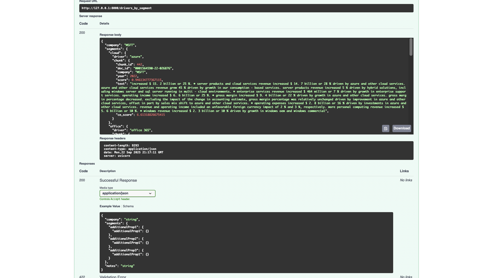
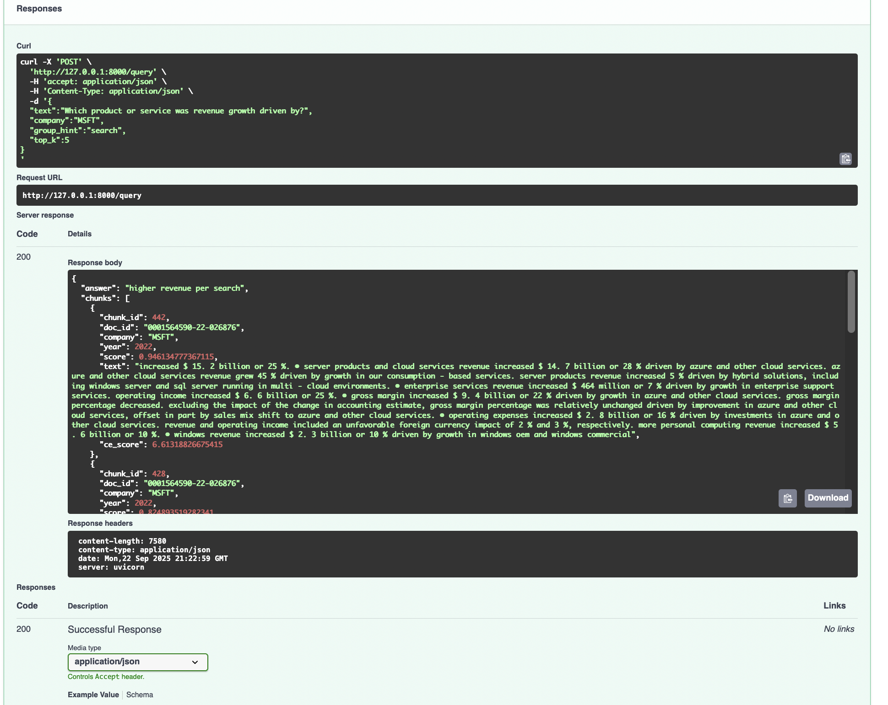
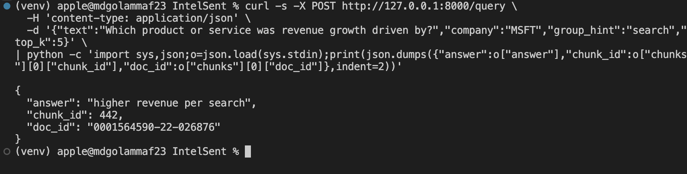

# IntelSent — Lean, Auditable SEC 10-K RAG

**What it is (one line):** A small, fast RAG service for SEC 10‑Ks that returns **short, source‑grounded “drivers”** (e.g., “driven by Azure”) with citations. Cheap to run, easy to deploy.

---

## Quick Demo (Local)

```bash
uvicorn serving.api:app --reload
```

**Targeted Q&A (with a group hint):**
```bash
curl -s -X POST http://127.0.0.1:8000/query \
  -H 'content-type: application/json' \
  -d '{"text":"Which product or service was revenue growth driven by?","company":"MSFT","group_hint":"search","top_k":5}'
```

**Drivers by segment (great for PMs/hiring panels):**
```bash
curl -s -X POST http://127.0.0.1:8000/drivers_by_segment \
  -H 'content-type: application/json' \
  -d '{"company":"MSFT","top_k":8}'
```

Open the interactive API: `http://127.0.0.1:8000/docs`

---

## End‑to‑End Pipeline
1. **Fetch** 10‑K HTML from the SEC Submissions API.  
2. **Chunk** HTML→text into ~256‑token windows.  
3. **Index** MiniLM embeddings (FAISS) + BM25 hybrid.  
4. **Retrieve** dense+BM25 (alpha‑weighted) → candidate pool.  
5. **Rerank** with a cross‑encoder.  
6. **Extract** “driven by …” short phrases.  
7. **Select** tiny learned selector (+ optional `group_hint`).  
8. **Serve** FastAPI with citations.

---

## Reproduce (Data → Eval → Serve)

```bash
# Data
python data/fetch_edgar_api.py
python data/chunker.py
python data/embedder.py

# Eval set + tiny selector
python scripts/build_eval_set.py
python scripts/train_selector.py
python scripts/eval_driver_dataset.py

# Serve
uvicorn serving.api:app --reload
```

**Current metrics (tiny eval set):**
- Overall: Recall@5 = **1.00**, EM = **0.80**, Canonical‑EM = **0.90** (10 items)  
- Revenue driver: Recall@5 = **1.00**, Canonical‑EM = **1.00** (6 items)

> *Canonical‑EM treats equivalent wording as equal (e.g., “search and news advertising” ≡ “search”).*

---

## Screenshots (PNGs under `docs/`)


### 1) Drivers by Segment (Swagger)
- Go to `http://127.0.0.1:8000/docs`
- Expand **POST /drivers_by_segment** → **Try it out**
- Use body: `{"company":"MSFT","top_k":8}`
- Click **Execute**, scroll to **Response body**, crop *tightly* to the JSON `segments` object.



### 2) Targeted Query (Swagger)
- In `/docs`, expand **POST /query** → **Try it out**
- Use body:
  ```json
  {
    "text":"Which product or service was revenue growth driven by?",
    "company":"MSFT",
    "group_hint":"search",
    "top_k":5
  }
  ```
- Click **Execute**, crop to show only the short `"answer"` and the first chunk id/doc id.



### 3) Targeted Query (CLI, compact)
- Run this to print a compact JSON (answer + citation IDs) to your terminal:
  ```bash
  curl -s -X POST http://127.0.0.1:8000/query \
    -H 'content-type: application/json' \
    -d '{"text":"Which product or service was revenue growth driven by?","company":"MSFT","group_hint":"search","top_k":5}' \
  | python - <<'PY'
import sys, json
o=json.load(sys.stdin)
print(json.dumps({
  "answer": o["answer"],
  "chunk_id": o["chunks"][0]["chunk_id"],
  "doc_id": o["chunks"][0]["doc_id"]
}, indent=2))
PY
  ```



---

## Compact Segment Drivers (Table)
> Generate the table with this command:

```bash
curl -s -X POST http://127.0.0.1:8000/drivers_by_segment \
  -H 'content-type: application/json' \
  -d '{"company":"MSFT","top_k":8}' \
| python - <<'PY'
import sys,json
o=json.load(sys.stdin)
rows=[("segment","driver","chunk_id","doc_id")]
for seg,v in o["segments"].items():
    c=v.get("chunk",{}) or {}
    rows.append((seg, v["driver"], c.get("chunk_id"), c.get("doc_id")))
w=[max(len(str(x)) for x in col) for col in zip(*rows)]
for r in rows:
    print(" | ".join(str(x).ljust(w[i]) for i,x in enumerate(r)))
PY
```

<!-- SEGMENT_TABLE_START -->
segment | driver         | chunk_id | doc_id              
cloud   | azure          | 442      | 0001564590-22-026876
office  | office 365     | 428      | 0001564590-22-026876
search  | search         | 428      | 0001564590-22-026876
xbox    | xbox game pass | 428      | 0001564590-22-026876
windows | search         | 442      | 0001564590-22-026876
iphone  | search         | 442      | 0001564590-22-026876
<!-- SEGMENT_TABLE_END -->

---

## Notable Files
- `serving/api.py` — FastAPI endpoints (`/query`, `/driver`, `/drivers_by_segment`)
- `rag/retriever.py` — FAISS + BM25 hybrid retrieval
- `rag/rerank.py` — cross‑encoder reranker
- `rag/extract.py` — regex/anchor phrase extraction
- `rag/selector.py` — learned selector (+ `group_hint`)
- `utils/canon.py` — canonicalization for fair EM
- `scripts/*` — fetch/chunk/embed/eval/train helpers

## Options
- **LangChain**: wrap retriever + reranker as an LC retriever tool.
- **Kubernetes**: simple Deployment + Service; mount `artifacts/` as a volume.
- **RAGAS**: add faithfulness/relevance on sampled queries.
- **QLoRA**: optionally fine‑tune a tiny head for selection.

## License
MIT
